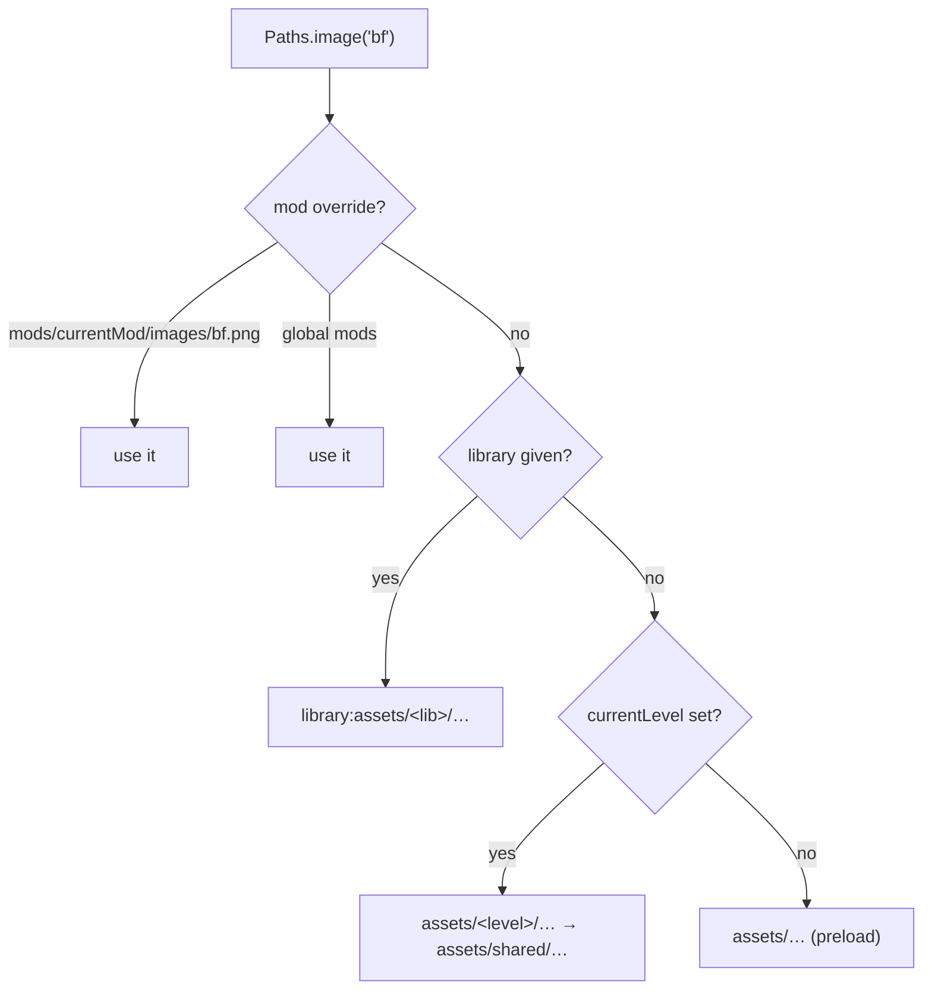

# Assets & paths

Every asset lookup in the engine goes through **`backend.Paths`**. Game code never builds a
path by hand — it asks for a *key* (`'ui/alphabet'`, `'freakyMenu'`, `'bf'`) and `Paths`
decides where that key actually lives for the current platform, mod and week.

## Extensions

```haxe
SOUND_EXT = #if (web || flash) "mp3" #else "ogg" #end;
VIDEO_EXT = "mp4";
IMAGE_EXT = "png";
```

`project.hxp` excludes `*.ogg` from web builds and `*.mp3` from native builds, so the
right file is the only one shipped.

## The lookup chain

`Paths.getPath(file, type, library, modsAllowed)`:

1. **Mods** (only when `MODS_ALLOWED` *and* `modsAllowed`) — `modFolders(file)` checks
   `mods/<currentMod>/<file>` first, then every *global* mod in order, and finally falls
   back to `mods/<file>`.
2. **Explicit library** — if a `library` was passed, `getLibraryPath()` returns
   `<library>:assets/<library>/<file>` when OpenFL knows it, else `assets/<library>/<file>`.
3. **Current level** — set by `Paths.setCurrentLevel(name)` when a week starts. Tries
   `assets/<level>/<file>`, then `assets/shared/<file>`.
4. **Preload** — `assets/<file>`.



## Typed helpers

| Helper | Resolves to |
|---|---|
| `Paths.image(key, ?parentFolder)` | `FlxGraphic` from `images/<key>.png`, cached |
| `Paths.getSparrowAtlas(key)` / `getPackerAtlas` / `getAsepriteAtlas` | atlas frames |
| `Paths.getMultiAtlas(keys)` | several atlases merged into one frame collection |
| `Paths.sound(key)` / `soundRandom(key, min, max)` | `sounds/<key>.<SOUND_EXT>` |
| `Paths.music(key)` | `music/<key>.<SOUND_EXT>` |
| `Paths.inst(song, difficulty)` / `voices(song, difficulty, postfix)` | song audio |
| `Paths.json(key)` / `txt` / `xml` / `file` | text assets |
| `Paths.lua(key)` | a Lua script path |
| `Paths.video(key)` | `videos/<key>.mp4` |
| `Paths.font(key)` | a font from `assets/fonts` |
| `Paths.shaderFragment(key)` / `shaderVertex(key)` | GLSL sources |
| `Paths.songEvents(song, difficulty)` | the events JSON for a chart |
| `Paths.getTextFromFile(key, ignoreMods)` | raw text, BOM-stripped |
| `Paths.exists` / `fileExists` / `imageExists` | existence checks |

Mod-specific variants: `Paths.mods(key)`, `modsImages`, `modsJson`, `modsXml`, `modsTxt`,
`modsFont`, `modsVideo`, `modsSounds`, `modsImagesJson`, and `Paths.playModMusic(file,
fallback, volume)` which tries a mod track, then the base theme, then the default.

:::tip UTF-8 BOM
`getTextFromFile` strips a UTF-8 BOM before parsing. Hand-edited JSON saved by Windows
editors used to crash the chart loader; always read text through `Paths`.
:::

## Caching and memory

`Paths` is also the asset cache:

| Member | Role |
|---|---|
| `currentTrackedAssets:Map<String, FlxGraphic>` | graphics currently kept alive |
| `localTrackedAssets:Array<String>` | assets belonging to the current state |
| `dumpExclusions` | assets that must never be freed (menu essentials) |
| `excludeAsset(key)` | adds a key to the exclusion list |
| `clearUnusedMemory()` | frees graphics no longer referenced |
| `clearStoredMemory(cleanUnused)` | clears the per-state cache between states |
| `warnedMissingAssets` | dedupes "missing asset" warnings |

`MusicBeatState` calls these on transitions; `InitState` calls both at boot. Long sessions
of chart editing or freeplay rely on this to keep RAM flat.

### Note and splash skins

`Paths` caches note skins separately because they are rebuilt on every song:

- `noteSkinFramesMap` / `noteSkinAnimsMap`
- `splashSkinFramesMap` / `splashSkinAnimsMap`, `splashConfigs`, `splashAnimCountMap`
- `initDefaultSkin`, `initNote`, `initSplash`, `initSplashConfig`, `addAnimAndCheck`
- `defaultSkin = 'noteskins/NOTE_assets' + NoteHelpers.getNoteSkinPostfix()`

## Asset libraries

Declared in `project.hxp`:

| Library | Folder |
|---|---|
| `default` | `assets/preload` |
| `shared` | `assets/shared` |
| `songs` | `assets/songs` |
| `videos` | `assets/videos` (only with `VIDEOS_ALLOWED`) |
| `week2` … `week7`, `weekend1` | `assets/week*` |

`assets/embed/` holds a handful of images embedded directly into the binary (used by the
sound tray, easter eggs and the mobile copy screen).

## Writing new asset code

- Add a typed helper to `Paths` instead of concatenating strings at the call site.
- Respect `MODS_ALLOWED`: anything that reads from `mods/` must be inside `#if MODS_ALLOWED`
  and should go through `modFolders`.
- Register long-lived graphics in `dumpExclusions` if they must survive a state change.
- On non-`sys` targets (`html5`, `flash`) there is no `FileSystem`; use
  `Paths.readDirectory`, which falls back to `Assets.list()`.
