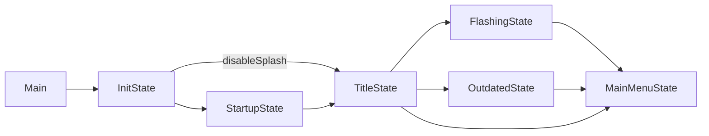

# Boot sequence

## `Main`

`source/Main.hx` is the OpenFL entry point (`MAIN_CLASS` in `project.hxp`). It is a plain
`openfl.display.Sprite` added to `Lib.current`:

```haxe
public static function main():Void {
  Lib.current.addChild(new Main());
}
```

### `__init__()` — before anything exists

Under `GAMEMODE_ALLOWED` (Linux desktop), requests Feral GameMode. Failure is non-fatal:
`gamemoded` may simply not be installed. `Main.shutdownGameMode()` releases it on exit.

### `new Main()`

In order:

1. `backend.deeplink.DeepLinks.init()` — registers the `phoenix://` handler so a link that
   launched the app is queued before any state exists.
2. **Mobile only**: `mobile.StorageUtil.requestPermissions()`, then on Android
   `android.platform.AndroidPlatform.init()` (lifecycle, media session, audio focus,
   gamepads, memory handling), then `Sys.setCwd(StorageUtil.getStorageDirectory())` so all
   relative paths resolve inside the app's storage.
3. `CrashHandler.init()`.
4. **Windows only**, via inline C++: `SetProcessDPIAware()` (crisp visuals),
   `SetConsoleOutputCP(CP_UTF8)` (correct console encoding) and
   `DisableProcessWindowsGhosting()` (the window stays movable when busy). The build pulls
   in `wininet.lib` and `dwmapi.lib` through `@:buildXml`.
5. `setupGame()`.

### `setupGame()`

- Computes zoom/size from the stage for older OpenFL versions.
- `ClientPrefs.loadDefaultStuff()` and, under `ACHIEVEMENTS_ALLOWED`, `Achievements.load()`.
- Constructs **`backend.FunkinGame`** (a `FlxGame` subclass) at 1280×720, 60 FPS,
  `skipSplash = true`, initial state `states.InitState`.
  On mobile with mods enabled, the initial state becomes `mobile.CopyState` instead when
  `CopyState.checkExistingFiles()` reports that assets still need to be copied to storage.
- Adds `debug.FPSCounter` (`Main.fpsVar`) and the screenshot plugin (`backend.SSPlugin`).

`Main.instance` is the global handle; `Main.isPlayState()` is the cheap check the FPS
counter and others use instead of repeated `Std.isOfType` calls.

:::note `-troll`
`Main.superDangerMode` is `true` when the executable is launched with the `-troll`
argument. It is read from `Sys.args()` and only exists on `sys` targets.
:::

## `states.InitState`

A bare `FlxState` whose only job is first-run initialisation:

| Step | What it does |
|---|---|
| Flixel setup | `focusLostFramerate = 60`, mute/volume keys from `TitleState`, `preventDefaultKeys = [TAB]`, `fixedTimestep = false` |
| Save binding | `FlxG.save.bind('funkin', CoolUtil.getSavePath())` |
| Input | `PlayerSettings.init()` |
| Preferences | `ClientPrefs.loadPrefs()` |
| Mods | `Mods.pushGlobalMods()` (under `MODS_ALLOWED`), then `Mods.loadTopMod()` so a mod can replace menu music/backgrounds from the very first frame |
| Memory | `Paths.clearStoredMemory()` + `Paths.clearUnusedMemory()` |
| Hand-off | `FlxG.switchState(ClientPrefs.disableSplash ? TitleState : StartupState)` |

## `states.StartupState` → `states.TitleState`

`StartupState` is the engine splash; pressing `ENTER`/accept, or letting it finish, moves
to `TitleState`. With *disable splash* enabled, `InitState` jumps straight to `TitleState`.

`TitleState` then either:

- goes to `states.FlashingState` (the flashing-lights warning) on a first run,
- goes to `states.OutdatedState` when `CHECK_FOR_UPDATES` finds a newer release,
- or goes to `states.MainMenuState`.



Deep links queued by `DeepLinks.init()` are consumed once the menu states exist — see
[Deep links](../subsystems/deep-links.md).

## Shutdown

- `Main.shutdownGameMode()` releases GameMode.
- `ClientPrefs.saveSettings()` persists preferences through `FlxG.save`.
- The Android platform layer unregisters its media session via `AndroidPlatform`.
