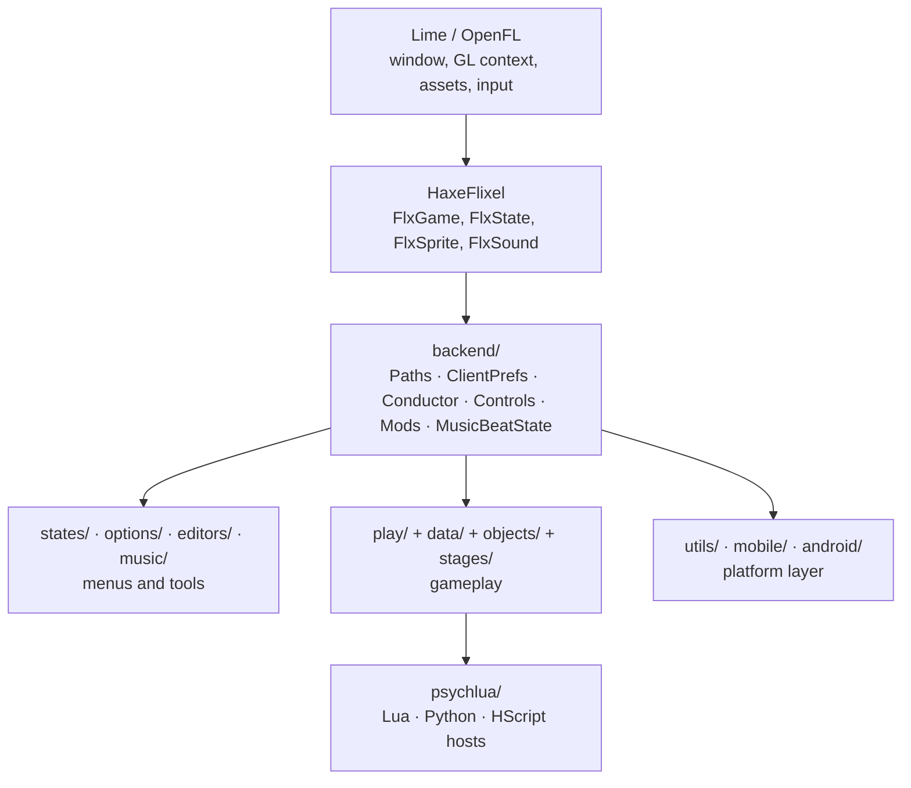

# Architecture overview

Phoenix Engine is a HaxeFlixel game, so the frame loop, display list and input come from
Flixel/OpenFL/Lime. Everything the engine adds sits in six layers:



## The layers

### 1. Framework (`lime`, `openfl`, `flixel`)

Pinned forks, plus **whole-file overrides** committed to the repo:

- `source/flixel/FlxGame.hx`, `source/flixel/addons/ui/*`, `source/flxanimate/PsychFlxAnimate.hx`
  — engine subclasses/replacements that live in `source/`.
- `source-haxelib-patches/**` — library fixes that shadow the haxelib copies through the
  class path. See [Haxelib patches](./haxelib-patches.md).

### 2. `backend/` — engine services

The layer every other package depends on, and the one that depends on nothing above it:

| Concern | Class |
|---|---|
| Asset resolution (mods → preload → shared) | `Paths` |
| Preferences and keybinds | `ClientPrefs`, `Controls`, `PlayerSettings`, `InputFormatter` |
| Song timing (beats, steps, BPM map) | `Conductor` |
| State bases with beat/step callbacks | `MusicBeatState`, `MusicBeatSubstate` |
| Mod discovery and ordering | `Mods` (or `ModsStub` without `MODS_ALLOWED`) |
| Week/song metadata | `WeekData`, `NoteTypesConfig` |
| Scores and achievements | `Highscore`, `Achievements` |
| Window, camera and screenshots | `WindowBackend`, `WindowColorMode`, `PsychCamera`, `Screenshot`, `SSPlugin` |
| Crash reporting, Discord, build info | `CrashHandler`, `DiscordClient`, `HaxeCommit` |
| Game subclass (fullscreen, frame handling) | `FunkinGame` |

### 3. Gameplay (`play/`, `data/`, `objects/`, `stages/`)

`play.PlayState` is the single state that plays a song. It was deliberately split: the
state keeps the fields and the Flixel lifecycle, while **`play/helpers/*`** holds the
logic as static modules that take the `PlayState` instance as their first argument
(`PlayStateInput`, `PlayStateNotes`, `PlayStateCamera`, `PlayStateRating`, …). `data/`
holds the chart model (`Song`, `Section`, `StageData`), `objects/` the reusable display
objects (`Note`, `Character`, `Alphabet`, …), `stages/` the hardcoded stages extending
`play.BaseStage`.

### 4. Menus and tools (`states/`, `options/`, `editors/`, `music/`)

Everything that is not a song: title, main menu, story, freeplay, mods manager, credits,
achievements, the options tree and the in-game editors. The same split pattern applies —
`states/helpers/`, `options/helpers/`, `editors/helpers/`, `editors/charting/`.

### 5. Scripting (`psychlua/`)

Three interpreters behind feature flags:

| Host | Flag | Library |
|---|---|---|
| `FunkinLua` | `LUA_ALLOWED` | `hxluajit` |
| `PythonScript` | `PYTHON_ALLOWED` | `hython` (pure Haxe) |
| `HScript` | `HSCRIPT_ALLOWED` | `hscript-improved` |

Lua and Python expose nearly the same function set, registered by the topic modules in
`psychlua/callbacks/` and `psychlua/pystdlib/`. `Convert` is the marshalling bridge with
direct-call fast paths for 0–8 arguments.

### 6. Platform layer (`utils/`, `mobile/`, `android/`, `headers/`)

Platform detection and native bridges are centralised rather than sprinkled through the
codebase: `utils.PlatformUtil` / `PlatformUtilNative` for desktop natives,
`mobile/` for touch controls and storage, `android/` + `android/platform/` for the JNI
bridges into `android/src/quack/fnf/phoenix/android/*.java`.
See [Platform layer](./platform-layer.md).

## Cross-cutting conventions

### Compile-time feature flags

Entire subsystems disappear from a build when their flag is off. Any code touching Lua,
Python, videos, Discord, shaders or mods must be inside `#if`:

```haxe
#if LUA_ALLOWED
for (script in luaArray) script.call('onUpdate', [elapsed]);
#end
```

The [code reference](../reference/index.md) records the active flags for every type and
member, so you can see at a glance what exists in a `-DMODDING_LEVEL=0` build.

### Header modules

`headers/` contains modules made only of `typedef` re-exports — `headers.Play`,
`headers.States`, `headers.Objects`, `headers.Options`, `headers.Editors`,
`headers.PsychLua`. Importing `headers.Play` pulls in all fourteen `play.helpers.*`
modules with one line.

### The global import file

`source/import.hx` is applied implicitly to every module: `backend.Paths`,
`play.BaseStage`, the Flixel essentials, `psychlua.*` under `#if LUA_ALLOWED`, and
`backend.Mods` or `backend.ModsStub` depending on `MODS_ALLOWED`. That is why engine files
can use `Paths`, `FlxG` or `ClientPrefs` with no visible import.

### Helper-module split

A recurring pattern, introduced to cut file sizes (PlayState 6448 → 3313 lines,
ChartingState 4821 → 2367, FunkinLua 3455 → 807):

```haxe
// play/helpers/PlayStateCamera.hx
class PlayStateCamera {
  public static function moveCameraSection(state:PlayState):Void { ... }
}
```

State classes stay thin and own the fields; helpers are stateless and receive the state.

## Where to go next

- [Source tree](./source-tree.md) — what each folder contains.
- [Boot sequence](./bootstrap.md) — from `main()` to the title screen.
- [State flow](./state-flow.md) — how the player moves between screens.
- [Assets & paths](./assets-and-paths.md) — the mod-aware lookup chain.
