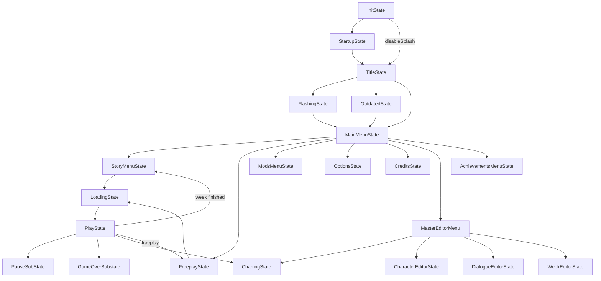

# State flow

Phoenix Engine is a Flixel game, so every screen is an `FlxState` and every overlay an
`FlxSubState`. The engine adds one layer on top: **`backend.MusicBeatState`** and
**`backend.MusicBeatSubstate`**, which give each screen song-synchronised callbacks and
mod-aware asset handling.

## The map



## States

| State | Package | Role |
|---|---|---|
| `InitState` | `states` | one-time setup, then hands off |
| `StartupState` | `states` | engine splash |
| `TitleState` | `states` | title screen, intro text, update check |
| `FlashingState` | `states` | photosensitivity warning |
| `OutdatedState` | `states` | shown when a newer release exists (`CHECK_FOR_UPDATES`) |
| `MainMenuState` | `states` | hub: story, freeplay, mods, credits, options, editors |
| `StoryMenuState` | `states` | week selection, difficulty, character display |
| `FreeplayState` | `states` | song list, scores, the music player |
| `ModsMenuState` | `states` | enable/disable/reorder mods |
| `CreditsState` | `states` | credits list |
| `AchievementsMenuState` | `states` | achievement gallery |
| `OptionsState` | `options` | options categories |
| `LoadingState` | `states` | async asset load before a song |
| `PlayState` | `play` | the song itself |
| `ErrorState` | `states` | crash screen |
| `MasterEditorMenu` + editors | `editors` | authoring tools |

Substates: `PauseSubState`, `GameOverSubstate`, `GameplayChangersSubstate`,
`ResetScoreSubState` (`states.substates`), `RenderingDoneSubState` (`states`),
the options category substates (`options/`), `psychlua.CustomSubstate` for scripts, and
`mobile.MobileControlsSelectSubState`.

## The `MusicBeatState` contract

```haxe
class MyState extends MusicBeatState {
  override function create():Void { super.create(); }
  override function update(elapsed:Float):Void { super.update(elapsed); }

  override function stepHit():Void { super.stepHit(); }        // 16× per section
  override function beatHit():Void { super.beatHit(); }        // 4× per section
  override function sectionHit():Void { super.sectionHit(); }  // 1× per section
}
```

`MusicBeatState` tracks `curStep`, `curBeat` and `curSection` from
[`Conductor`](./conductor-and-timing.md), handles the transition in/out, exposes
`controls` (from `PlayerSettings`), and takes care of clearing per-state asset caches
through `Paths`.

Menus use the beat callbacks for bopping icons and dancing characters; `PlayState`
forwards them to the active stage and to every loaded script.

## Transitions

- Switching is plain Flixel: `FlxG.switchState(MainMenuState.new)` (or
  `FlxG.switchState(() -> new ModsMenuState())` when the constructor takes arguments).
- `FlxTransitionableState.skipNextTransIn` is used to suppress the fade on the very first
  transition (set in `InitState`).
- `shaders.CustomFadeTransition` provides the engine's fade; `shaders.CrossFade` is the
  separate character-crossfade effect used during gameplay.

## Entering gameplay

Both story and freeplay set up the same statics before switching:

| Static | Meaning |
|---|---|
| `PlayState.SONG` | the loaded `SwagSong` |
| `PlayState.isStoryMode` | story vs freeplay behaviour (next song, transitions, saves) |
| `PlayState.storyPlaylist` | remaining songs in the week |
| `PlayState.storyDifficulty` | selected difficulty index |
| `PlayState.campaignScore` / `campaignMisses` | running week totals |

`LoadingState` sits in between to preload the song's assets; on finish it constructs
`PlayState`. When the song ends, `PlayState` either loads the next entry of
`storyPlaylist`, returns to `StoryMenuState`, or returns to `FreeplayState`.

## Adding a state

1. Extend `MusicBeatState` (or `MusicBeatSubstate`).
2. Put heavy logic in a helper module under `states/helpers/` instead of the state itself.
3. Load assets through `Paths`, never with a literal path.
4. If scripts should see it, broadcast a hook through the script host the way
   `PlayState` does — see [Script hooks](../modding/script-hooks.md).
5. Re-export it from `headers.States` if it belongs to an existing group.
