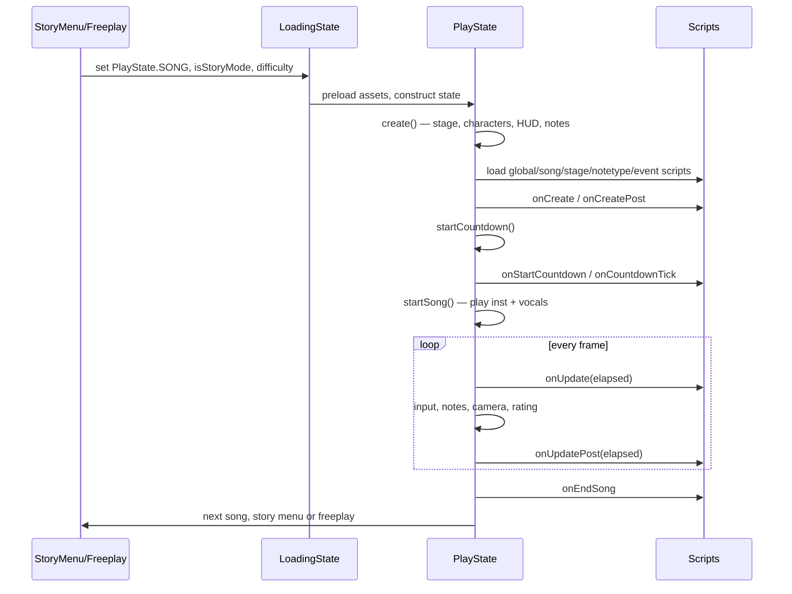

# Gameplay — `play.PlayState`

`PlayState` is the state that plays a song. It is the largest and most-modified class in
any FNF engine, so Phoenix splits it: the **state owns the fields and the Flixel
lifecycle**, and fourteen **static helper modules** in `play/helpers/` own the logic. The
original 6448-line file is now ~3313 lines.

## The helpers

Each helper is a `class` of static functions whose first argument is the `PlayState`
instance (or that read `PlayState.instance`). They are re-exported together by
`headers.Play`.

| Helper | Owns |
|---|---|
| `PlayStateChartLoader` | loading the `SwagSong`, building the note list, applying speed/pitch |
| `PlayStateNotes` | note spawning, recycling, sorting and despawning |
| `PlayStateNoteHelpers` | per-note math shared by input and rendering |
| `PlayStateInput` | key press/release, hit detection, ghost tapping, botplay |
| `PlayStateRating` | judgement, accuracy, combo, rating text and FC tracking |
| `PlayStatePlayback` | instrumental/vocals, resync, pause/resume, playback rate |
| `PlayStateCamera` | camera follow, zooming, bopping, tweened zoom events |
| `PlayStateCharacters` | loading bf/dad/gf, sing animations, idle/dance, alt animations |
| `PlayStateCountdown` | the 3-2-1-Go sequence and its skipping rules |
| `PlayStateCutscenes` | video and dialogue cutscenes before/after a song |
| `PlayStateEvents` | the built-in chart event handlers |
| `PlayStateScripts` | loading Lua/Python/HScript files and broadcasting hooks |
| `PlayStateRender` | HUD assembly and per-frame HUD updates |
| `PlayStateAndroidMedia` | pushes song metadata to the Android media session |

:::tip Where should my change go?
If it touches a *field* of `PlayState`, add the field to the state and put the behaviour in
the matching helper. Adding behaviour straight into `PlayState.update()` is how the file
got to 6000 lines the first time.
:::

## Lifecycle of a song

### `create()` in order

1. Statics and conductor setup, `Paths.setCurrentLevel(...)`.
2. Stage: `StageData.loadDirectory(SONG)` then the hardcoded `stages/` class or a JSON
   stage; stage props are added to `gfGroup`, `dadGroup`, `boyfriendGroup`.
3. Crossfade groups (`grpCrossFade`, `grpGFCrossFade`, `grpBFCrossFade`).
4. Script debug overlays (`luaDebugGroup`, `pythonDebugGroup`).
5. **Global scripts** — every `.lua` / `.py` in, in priority order:
   `mods/<globalMod>/scripts/`, `mods/<currentMod>/scripts/`, `mods/scripts/`,
   `assets/preload/scripts/`. A file name is only loaded once.
6. **Stage scripts** — `stages/<curStage>.lua` / `.py`.
7. Characters (`gf`, `dad`, `boyfriend`), honouring `hide_girlfriend` and
   `ClientPrefs.charsAndBG`.
8. HUD: strums, health bar, icons, score text, time bar — `PlayStateRender`.
9. Chart: `PlayStateChartLoader` generates notes and events; notetype and event scripts are
   loaded on demand (`custom_notetypes/<type>.lua`, `custom_events/<event>.lua`).
10. `onCreate` → `onCreatePost` hooks, then the countdown.

### Static entry fields

| Field | Set by |
|---|---|
| `PlayState.SONG:SwagSong` | freeplay / story / chart editor |
| `PlayState.isStoryMode:Bool` | the menu that launched the song |
| `PlayState.storyPlaylist:Array<String>` | story mode |
| `PlayState.storyDifficulty:Int` | the difficulty selector |
| `PlayState.instance` | set in `create()`; the handle scripts use |

## Note flow

1. **Chart load** — `PlayStateChartLoader` turns sections into `objects.Note` instances
   with `strumTime`, `noteData`, `mustPress`, `noteType`, sustain chains and per-note
   health/score modifiers (see [Charts & songs](./charts-and-songs.md)).
2. **Spawning** — `PlayStateNotes` moves notes from `unspawnNotes` to `notes` shortly
   before they are visible; sustains are handled as parent/child chains
   (`parentST`, `parentSL`).
3. **Input** — `PlayStateInput` resolves presses against hittable notes using
   `Conductor.safeZoneOffset`, applying ghost tapping, anti-mash and botplay rules.
4. **Judgement** — `Conductor.judgeNote()` + `PlayStateRating` update score, combo,
   accuracy, health and the popups (`play/objects/JudgeText`, `MSText`).
5. **Recycling** — notes are pooled; `ClientPrefs.maxSplashLimit` caps splashes, and
   `comboStacking` controls popup accumulation.

Performance note: note iteration is batched and the key arrays are inlined — avoid adding
per-note allocations or `Reflect` calls inside these loops.

## Scripts

`PlayStateScripts` is the bridge to [modding](../modding/overview.md):

| Function | Purpose |
|---|---|
| `callOnScripts(name, args)` | broadcast to Lua **and** Python |
| `callOnLuas` / `callOnHScript` | target one host |
| `setOnScripts(name, value)` | publish a variable to every script |
| `startLuasOnFolder(path)` / `startPythonScriptOnFolder(path)` | load an extra script by relative path |

Return values matter: `FunkinLua.Function_Stop` cancels the engine's default behaviour for
that hook, `Function_StopLua` stops propagation to further Lua scripts, and
`Function_Continue` is the neutral result.

## Pausing, game over, restarting

- `PauseSubState` — resume, restart, change gameplay settings, open the chart editor,
  quit. Pausing stops the conductor and all tweens/timers tracked by the state.
- `GameOverSubstate` — refactored to a generic fallback with safer null handling; the
  character, sound, loop and end-sound come from the chart (`gameOverChar`,
  `gameOverSound`, `gameOverLoop`, `gameOverEnd`) with engine defaults.
- `endSong()` saves score/highscore, fires `onEndSong`, then advances the story playlist or
  returns to the menu.

## Related reference pages

- [`play.PlayState`](../reference/play/PlayState.md)
- [`play.helpers`](../reference/play-helpers/index.md)
- [`play.BaseStage`](../reference/play/BaseStage.md)
